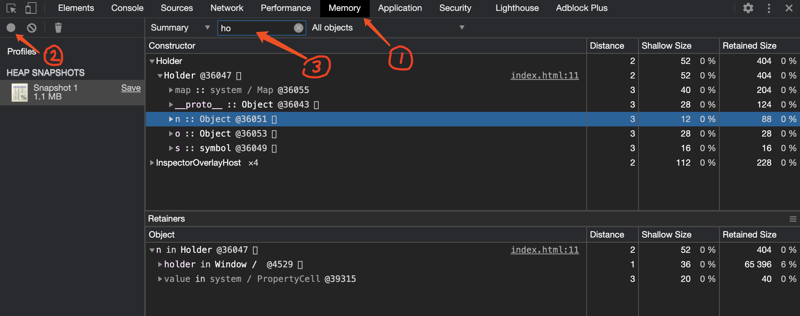
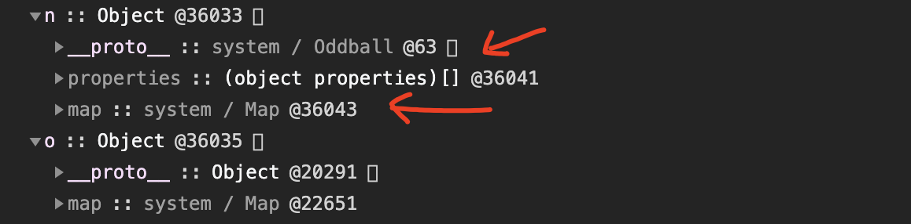

# v8-javascript-memory

V8 JavaScript 内存占用分析。

> 回答知乎的问题：[v8 中 Symbol() 、Object.create(null) 和 {} 的内存占用分别是多少？](https://www.zhihu.com/question/425300093/answer/1523228095)

## 步骤

1. 使用 Chrome 浏览器访问 <https://justjavac.com/v8-javascript-memory/>

1. 打开 Dev Tools，如图：

  

  1. 选择 Memory 标签页
  1. 点击 take heap snapsshot
  1. 在过滤框中输入 `ho` 快速过滤出 holder

## 名次解释

**Shallow Size**：对象自身占用内存的大小，不包括它引用的对象。JavaScript 对象会将一些内存用于自身的说明和保存中间值。通常，只有数组和字符串会有明显的浅层大小。

**Retained Size**：这是将对象本身连同其无法从 **GC root** 到达的相关对象一起删除后释放的内存大小。

单位是字节(Byte)。

## 分析

从截图中可以看到，`Symbol()` 的内存占用是 16。

`Object.create(null)` 自身占用 12，总占用 88。

`{}` 自身占用 28，总占用 28。

继续展开你会看到其他信息：

1. `__proto__` 是原型链。
2. `map` 就是很多文章都在介绍的 V8 对象的黑魔法 Hidden Class。

## License

本作品由 <a xmlns:cc="https://creativecommons.org/ns#" href="https://justjavac.com" property="cc:attributionName" rel="cc:attributionURL">justjavac</a> 创作，采用<a rel="license" href="https://creativecommons.org/licenses/by-nc-sa/3.0/cn/">知识共享署名-非商业性使用-相同方式共享 3.0 中国大陆许可协议</a>进行许可。凡是转载的文章，翻译的文章，或者由其他作者投稿的文章，版权归原作者所有。
